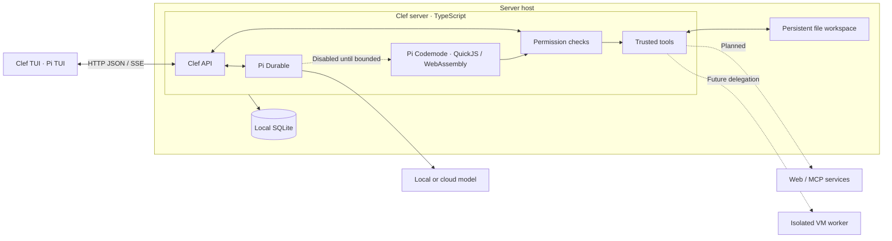
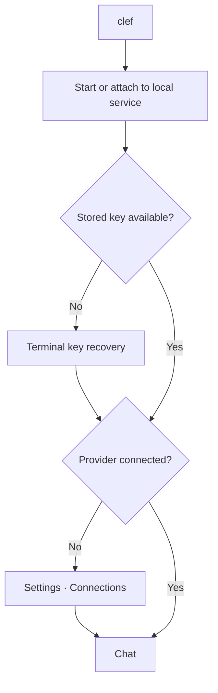

# Architecture

Clef is a server with a separate terminal client. See [implementation limits](INTENT.md#first-implementation) and the [development workflow](CONTRIBUTING.md).



Pi Durable is an imported server library, not a separate service. The server owns the agent loop, conversations, permissions, and stored state. The TUI renders state and submits commands. There is no web app, client-side agent loop, or direct client access to the database.

## Server modules

Clef is a feature-based modular monolith. Put code that changes together in the same feature. Keep implementation details behind a small public interface.

```text
src/main.ts                  CLI dispatch and client/server composition
src/server/
  main.ts                    HTTP listener startup
  app.ts                     Explicit feature construction and route registration
  lifecycle/                 Native service, process ownership, private readiness
  platform/                  Database connections and technical HTTP/SSE mechanisms
  access/                    Local authentication and revocable remote clients
  credentials/               Installation key, encrypted provider credentials, recovery
  permissions/               Pending approvals and saved access rules
  settings/                  Configuration validation, persistence, and activation
  models/                    Provider connections and model selection
  agent/                     Pi Durable and restricted execution integration
  messages/                  Conversation and message API
```

### Inside a feature

| File | Responsibility |
| --- | --- |
| `index.ts` | Small public interface and feature construction |
| `contract.ts` | Client-safe request/response schemas and types |
| `routes.ts` | Validate HTTP input and call feature operations |
| `service.ts` | Operations and their ordering |
| `model.ts` | Domain types and rules |
| `repository.ts` | Owned tables, SQL, and schema changes |
| `*.test.ts` | Unit and integration tests through public interfaces |
| `*.e2e.spec.ts` | Real-server and process journeys |

Create files only for distinct responsibilities. Do not require every operation to pass through every layer. Do not introduce a generic repository framework, duplicated data types, or forwarding layers without a need.

### Import rules

A server feature can use another feature only through its `index.ts` or `contract.ts`. Private files remain private, including type-only imports and tests in other features. Clients can import only public contracts. Contracts use Zod and other contracts, not Node APIs, server implementation, or Pi harness types.

The platform contains shared technical mechanisms, not feature policy. It cannot import features. Features cannot import the composition root or startup module. Connect dependencies with explicit arguments. Do not add a service locator, global container, or event bus to hide direct dependencies.

### Data ownership

Each feature owns its tables, schema changes, and queries. Pass the shared database handle when constructing the feature; do not expose it through the feature interface. Other features request operations from the owner, not SQL against its tables.

The platform opens and closes SQLite and owns technical process locks. It does not own business tables. Access owns client-token hashes. Credentials owns encryption and the key file. Settings owns file validation and activation; models and permissions supply their section schemas. Pi Durable remains the sole owner of harness messages and task state.

Coordinate cross-feature operations through explicit public interfaces. A sequence of writes is not an atomic transaction. Define failure and recovery behavior when an operation crosses durable stores.

### Enforcement and change locality

Dependency Cruiser rejects private cross-feature imports, unsafe contracts, cycles, client imports of server implementations or the harness, and server imports of clients. Feature folders are discovered automatically. Platform code cannot depend on features. Rules include type-only imports.

Only `lifecycle/supervisor.ts` can import `child_process` in production. It accepts fixed launchctl and systemctl operations with argument arrays and no shell. This does not grant host execution to models. Host VM execution remains forbidden. The platform database module remains the only SQLite driver owner.

Architecture tests exercise allowed and forbidden imports in temporary projects. They check feature entry points, the executable client, and the no-comments rule. See [quality gates](CONTRIBUTING.md#check-a-change).

An internal feature change should normally change one feature directory. A contract change can require client changes; a new feature can require composition changes. Static checks cannot prove table ownership or good domain design. Review those properties. Changes to these rules require David's approval.

## Terminal modules

```text
src/client/                  Authenticated transport and saved remote credentials
src/tui/
  index.ts                   Public terminal entry points
  app.ts                     Chat lifecycle, commands, and screen composition
  connect.ts                 Remote-token prompt
  messages/                  Transcript and inline approvals
  conversations/             Conversation search and local selection
  settings/                  Model, provider, permission, and client configuration
  components/                Application-independent controls and semantic styles
```

Pi TUI owns the main-screen renderer, multiline editor, Markdown, and selection controls. Clef composes these controls rather than implementing a terminal renderer. The main screen retains normal terminal scrollback. The composer and status stay at the bottom. Short conversations sit above the composer and move upward as content grows. A six-dot spinner and `Working` appear in the composer's top border during agent work. The spinner stops for approvals, disconnection, completion, and exit. User messages have a full-width background fill. User and assistant messages have no speaker labels. The header shows `⌬ Clef`, the model, and the thinking level. Connection headers also use `⌬ Clef`. Settings use overlays; secret input is masked. Use the terminal's background and ANSI palette.

Terminal features expose `index.ts`. Shared components cannot import Clef contracts, clients, or features. `src/client/` owns HTTP, response validation, SSE parsing, reconnect, and remote-token persistence. The terminal and transport import only server contracts, never Pi Durable types.

## Client interface

`clef` attaches to an existing local server or starts the native service, then opens chat. It can attach to a foreground development server without registering a service. The launcher obtains a local endpoint and credential through the private readiness socket. The TUI receives an authenticated client; it does not manage the service or read server files. Closing the terminal leaves agent work and the server running.

`clef --server <origin>` bypasses local service startup. The same client operations connect to a remote server. HTTPS is required except for literal loopback addresses and `localhost`, which also support SSH tunnels. Reject URL credentials, paths, queries, fragments, and redirects. Keep the server bound to IPv4 loopback; use a separately configured HTTPS reverse proxy, such as Tailscale Serve. See [remote connection instructions](INSTALLATION.md#remote-connections).

The transport validates responses against feature contracts. JSON responses and buffered SSE updates have a 4 MiB limit. Streaming reconnects use full snapshots, not an in-memory event history. Failed mutations are not automatically replayed. A rejected or uncertain message retains its draft and request ID for a deliberate retry of the same text.

### Local HTTP and conversation lifecycle

Every API route requires a bearer credential. Browser-origin and browser-fetch requests are rejected. There are no browser cookies, account login routes, static pages, or setup links. A reverse proxy must preserve Authorization and must not buffer SSE.

The server has one main conversation: the newest stored ownerless conversation. It creates one if none exists. `POST /api/conversations` creates a new main without stopping older replies. `GET /api/conversations?query=<search>` searches first-message labels and returns up to 50 results. Main stays first, even when it does not match; other matches follow by recent stored activity. Pi Durable remains the only conversation store.

Conversation operations accept an optional `id` query parameter. Without it, they use main. Explicit IDs target one conversation, including messages, stop, approvals, and SSE. When main changes, its following streams reconnect to the new conversation; explicitly selected streams stay where they are. The TUI owns its selection, not a separate agent loop. Switching does not change main, cancel replies, or persist a client preference. See [terminal commands](README.md#chat-and-commands).

Commands use HTTP JSON at `/api/conversation`. SSE sends validated snapshots and permission updates. The agent adapter also reads Pi Durable's unanswered submissions. It shows a safe error when a turn fails without a model error message, including after restart. These display errors do not become model messages or duplicate errors already in the transcript. Streams renew at least once per minute, which rechecks authorization. Revoking a client closes its active responses. Send requests carry an ID for duplicate prevention. Stop cancels active work but cannot undo completed actions.

Saved model and thinking settings apply to the next message. An active reply keeps its settings unless an approved agent self-switch changes the next model request. The TUI removes terminal control sequences from server text before rendering. It does not fetch model-supplied images or execute model-supplied terminal commands.

## Access and secrets

Local access trusts the installation's OS user, not a Clef password. Access creates an owner-only random credential in the installation's `secrets` directory. Only the private local readiness socket returns it to the launcher. Public routes and service logs never return it.

A local client can issue a separate random 256-bit token for each remote client. The raw token is shown once. SQLite stores its SHA-256 hash, name, creation time, and ID. Tokens remain valid until revoked. Remote clients cannot issue or revoke client tokens. All authorized clients can chat and configure providers, models, and permissions.

Remote client tokens are bearer secrets. The client saves each token in an owner-only file under `${XDG_CONFIG_HOME:-$HOME/.config}/clef/connections`, keyed by a hash of the exact server origin. It does not pass tokens in command arguments, URLs, or model context. This protects against other OS users, not code running as the same user or an administrator.

Provider credentials remain in Clef's encrypted secret store. Do not use plaintext Pi `auth.json` storage. The installation encryption key is separate from access tokens. On a new installation, the server creates the key with a secure random generator and keeps it outside SQLite and the workspace. Existing encrypted credentials and their key are preserved when accounts are removed. Account and cookie-session tables are removed; there is no password-login compatibility path.

If an established installation cannot load its key, keep secret-dependent work blocked. Do not generate a replacement key. The TUI asks for the original key for recovery. Back up the key separately from the database. Keep secret values out of application logs, traces, analytics, and model context.

This protects encrypted secrets in a copied database. It does not protect against a compromised running server. Messages, traces, and workspace files are not encrypted by this design. It is not end-to-end encryption.

## First startup and setup



The server provisions local access and a new installation key automatically. The first terminal session opens provider configuration. It does not ask for a Clef username or password. The user can connect a provider by sign-in, API key, or Ollama URL. Subsequent sessions open the existing chat.

launchd manages macOS installations; systemd's user manager manages Linux installations. Both invoke `clef serve`. A private Unix socket and the native PID establish readiness. The service persists beyond the launching terminal and starts with the user session, not before user login. See [service controls](INSTALLATION.md).

## Storage

Use local SQLite for structured runtime state, including client-token hashes, encrypted secrets, messages, and Pi Durable task state. One server process owns the database. The canonical process entry holds a kernel-released SQLite transaction lock before opening application data. A separate lock serializes lifecycle commands.

Keep skills, active projects, notes, and other files in a persistent folder or volume. Keep the database separate from the file workspace. Database, configuration, key, and workspace must survive package replacement. Use a SQLite-safe backup method, not a copy of only the active main database file.

### Configuration files and live activation

`settings.yaml` in the installation directory is the source of truth for model defaults, provider references, the Ollama URL, and saved permission rules. Settings owns file operations. Models and permissions own their schemas. Credentials remain in the shared encrypted secret store. A reference does not grant access to a secret.

The file accepts version 1 with `models` and `permissions` sections. It must be a regular file of at most 64 KiB. Reject symlinks, YAML aliases, duplicate keys, unknown fields, and unknown tags. Cloud references must use `provider:<id>` for the same registered provider. Ollama uses a canonical HTTP or HTTPS URL without a secret reference.

Reads load changes lazily. Validate the complete replacement before activation. A failed reload keeps the last valid snapshot, returns a safe diagnostic, and blocks writes until repair. Invalid initial configuration prevents startup. Reloads do not restart the server or interrupt model streams. New model selections require an available model and a supported thinking level. A saved unavailable model remains explicit; do not switch to another provider.

Clients can inspect `/api/settings`, validate YAML through `/api/settings/validate`, and replace it with `PUT /api/settings`. Replacement requires the current revision. Writes are serialized, validated, flushed, and renamed. A second revision check detects external edits before replacement. External editors do not join the write queue: do not edit a file at the same time as an API or tool write. The final check and rename are not a cross-process transaction.

The agent has two trusted configuration tools, not general file access:

- `settings_inspect` returns validated non-secret model configuration, revision, safe diagnostic, saved-rule count, and at most 20 model choices. Results over 16 KiB are rejected before returning to the harness.
- `settings_change` accepts only a revision, exact model defaults, and a switch option for the calling conversation. It cannot change permissions, endpoints, references, credentials, or another conversation. Its acknowledgement is bounded to 1 KiB.

Every change requires authenticated approval unless an exact saved rule applies. The request binds revision, target defaults, conversation, and tool task. Permit at most one pending configuration request per conversation and 100 pending approvals overall. Requests expire after 120 seconds. Stop and restart cancel them. Stale, repeated, and cross-conversation decisions cannot authorize a change. Always and Never apply only to the displayed conversation, model, thinking level, and switch option. Reject duplicate saved scopes.

An approved switch uses Pi Durable's conversation configuration operation. It changes the next model request, not the current generation. Saving defaults and switching the conversation are separate durable writes. An interruption can leave new defaults saved without switching the active reply. Those defaults still apply to the next user message. Mutating tools use unsafe replay policy: recovery does not repeat the action automatically. Inspect settings and conversation before retrying.

Generic secret references, extension configuration, and scoped file tools remain planned. Keep authentication, permission checks, and storage ownership outside replaceable configuration.

## Code execution and permissions

Use Pi Codemode for model-written JavaScript. It runs QuickJS compiled to WebAssembly in a worker thread. The worker keeps execution off the main event loop; the restricted runtime and checked host calls enforce access. A worker thread or separate folder is not a sandbox by itself.

Guest scripts have no direct Node APIs, filesystem, network, or server credentials. Validate arguments and permissions for every host call, including nested calls, loops, and parallel scripts. Do not evaluate model code or import untrusted extensions in the host JavaScript environment.

Deny external access by default. Show the action, destination, and exact scope through the API:

| Choice | Effect |
| --- | --- |
| Deny | Reject this action without saving a rule. |
| This time | Allow this action only, not the whole script. |
| Always | Save an allow rule for the displayed scope. |
| Never | Save a deny rule for the displayed scope. |

Store persistent rules in configuration files. Users can inspect and revoke them in Settings. Scripts cannot grant themselves permissions. Bind approvals to pending actions; reject cancelled and expired requests. Check destinations and redirects before network requests. Approval of an MCP URL is not approval of all its tools; Clef cannot enforce its sandbox inside an independent MCP server.

Only the two bounded configuration tools are enabled. Keep scripts, shell tools, general file tools, network tools, and imported extensions disabled until required bounds are tested. Bound execution time, guest memory, output before host accumulation, return values, and host-call work. Permission waits expire. Cancellation signals tools and cancels approvals but cannot undo completed side effects. Do not blindly replay interrupted scripts.

### Future VM workers

VMs are optional workers for bounded delegated tasks that need browser use, computer control, or a separate OS isolation boundary. They are not the default home of the main agent. Ordinary trusted tool implementations can make approved requests in-process.

Give workers only their task data and granted capabilities. Never inherit server credentials, the installation key, unrestricted host access, or the whole workspace. A VM does not make actions on exposed files or signed-in accounts safe. Direct host computer use remains a separate future capability.

## Model providers

Use Pi's `pi-ai` layer beneath Pi Durable. Store provider tokens and API keys in Clef's encrypted secret store.

| Provider | Access methods |
| --- | --- |
| OpenAI | ChatGPT sign-in or an OpenAI API key |
| OpenRouter | Sign-in or an API key |
| Anthropic | API key |
| Ollama | Server URL; no user API key |
| Other Pi providers | Methods supported by the provider adapter |

ChatGPT subscription access and OpenAI API billing are separate. Provider sign-in presents the provider URL and any prompt in the TUI. The user opens the URL in their browser; Clef does not launch one automatically. The browser and server can be on different machines. Cancellation closes the server-side login flow. Model connections never silently replace existing defaults.

Ollama discovery uses `/api/tags` and `/api/show` with a ten-second deadline. The models feature registers results with Pi's OpenAI-compatible adapter. It uses the fixed, non-secret client parameter `ollama`, as described by [Ollama](https://docs.ollama.com/api/openai-compatibility). This is not an issued key, is not stored as a credential, and does not secure the connection.

The Ollama URL is reached by the server, not the TUI. Offer installed local chat models, not cloud aliases. Thinking controls use Ollama metadata and Pi's supported levels. Startup repeats discovery. Failures preserve the selected URL and defaults and appear in the catalog. The next catalog or default-model read retries failed discovery; concurrent reads share the pending attempt. Recovery does not replay unanswered messages or switch providers. A failed replacement connection leaves the active connection unchanged.

## Host environment and data flow

Direct installations support Linux and macOS. Linux container packaging is planned; on macOS it can use a Linux VM through tools such as OrbStack. Clef has no direct Windows installation path. In a container, the host environment means the container, not the underlying computer. A container is not a VM and does not protect mounted files or supplied credentials.

Keep tools restricted separately from server access. Direct installation has no container isolation. The user selects a local or cloud model; a cloud model receives the context sent to it. Never silently switch from local to cloud inference.
