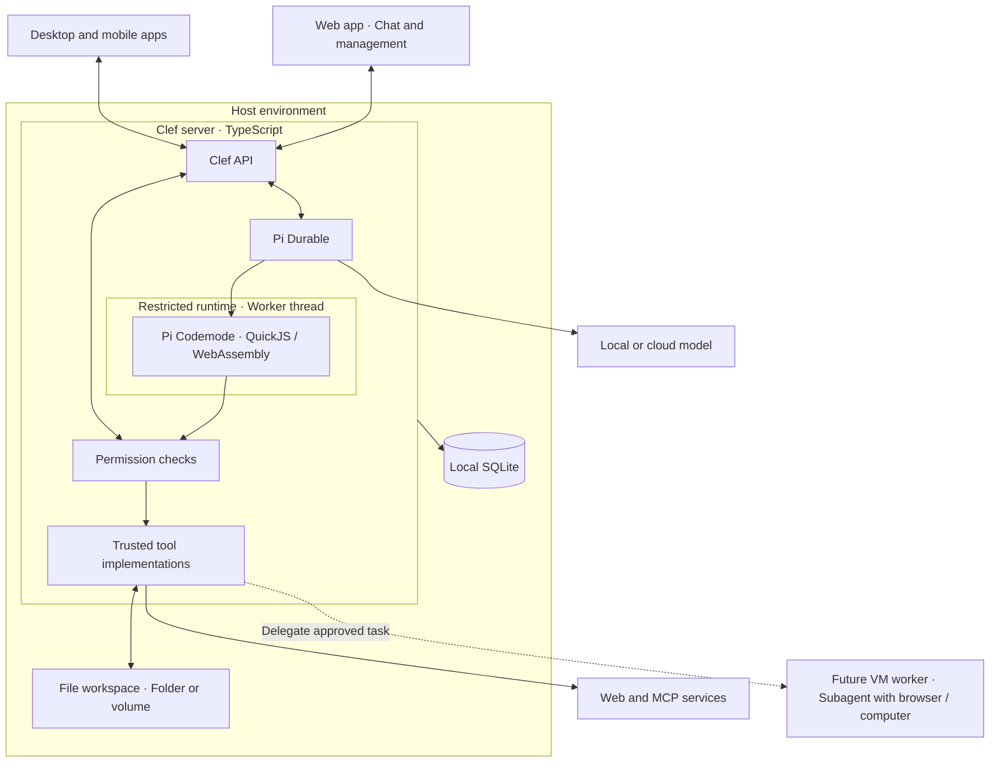
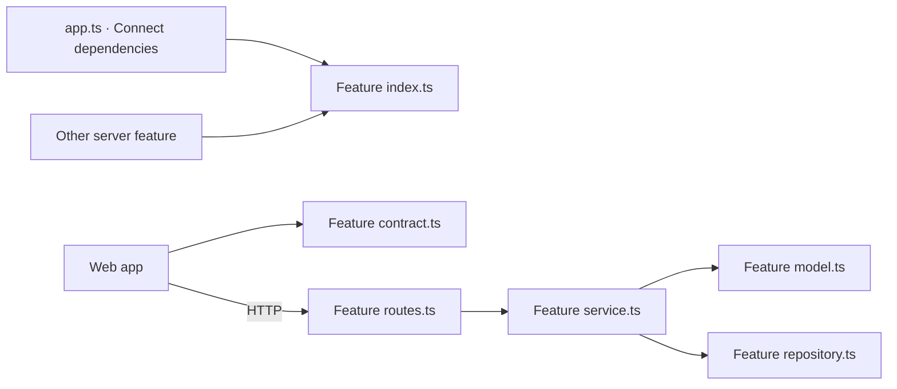
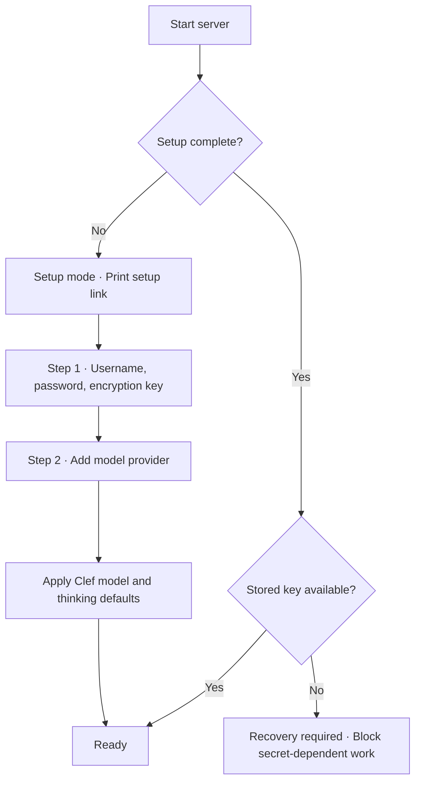

# Architecture

This document defines the target structure and its rules. See [First implementation](INTENT.md#first-implementation) for the executable scope and known limits.



The server is the core of Clef. API handlers, Pi Durable, and trusted tool implementations run in the same server process. Pi Durable is an imported library, not a separate service. The server owns conversations and stored state. It also serves the web app for chat, setup, and management.

Do as much work as possible in-process through restricted runtimes and permission-checked tools. A tool can make a web request without a separate service. A local model can run on the same computer as the server.

Pi Codemode runs model-written JavaScript in a restricted runtime within the server process. The first MVP does not expose a host shell or include Just Bash. A VM is a future optional worker for delegated tasks, not the default home of the main agent.

## Server modules

Clef is a feature-based modular monolith: one server process with separate domain modules. Put code that changes together in the same feature. Keep implementation details behind a small public interface.

```text
src/server/
  main.ts                    Process entry and shutdown
  app.ts                     Explicit module construction and route registration
  lifecycle/                 Native user service, process ownership, and private readiness
  platform/database.ts       Database connections, process locks, and installation paths
  accounts/                  Account setup, passwords, and login sessions
  credentials/               Encryption key, encrypted credentials, and recovery
  permissions/               Pending approvals and saved access rules
  files/                     Checked file operations and directory access settings
  settings/                  Configuration file validation and activation
  models/                    Provider connections and model selection
  agent/                     Pi Durable and Codemode integration
  messages/                  Conversation and message API
```

The tree defines ownership as the modules are built. It is not a requirement to create empty modules in advance.

### Inside a feature

| File | Responsibility |
| --- | --- |
| `index.ts` | Small public server interface and feature construction |
| `contract.ts` | Browser-safe request/response schemas and types |
| `routes.ts` | Validate and translate HTTP requests; call feature operations |
| `service.ts` | Implement operations and their ordering |
| `model.ts` | Domain types, rules, and calculations |
| `repository.ts` | Owned tables, SQL, and schema changes, when needed |
| `*.test.ts` | Unit and integration tests through useful public interfaces |
| `*.e2e.spec.ts` | Feature E2E tests against the real app |

Use only files that have a distinct responsibility. Do not require every operation to pass through every file. Do not add a generic repository framework, duplicated DTOs, or forwarding layers without a real need.



### Import rules

A server feature can use another feature only through its `index.ts` or `contract.ts`. Its private files stay private, including their types. A client can import only public contracts. Contracts use Zod and other contracts; they do not import Node APIs, server implementation, or Pi types. The contract is owned by its feature, not by a global contracts file.

The platform contains shared mechanisms, not feature policy. It cannot import features. Features cannot import `app.ts` or `main.ts`. Dependencies are explicit function arguments or constructor arguments. Do not use a global service locator, dependency-injection container, or event bus to hide direct dependencies.

### Data ownership

One database connection can serve several features. This does not make one module the owner of all storage. Each feature defines its own tables and queries in its repository. Other features request operations through the owning feature's public interface, not SQL against its tables.

The platform opens and closes SQLite. It contains no feature tables or schema changes. The credentials module owns the key file and encryption. Accounts own password hashes and login sessions. Permissions own saved rule schemas and decisions. Settings owns configuration file reads, validation, replacement, and activation. Models and permissions supply their section schemas. Pi Durable remains the storage authority for harness messages and tasks; do not add a second message repository beside it.

Coordinate operations that cross features through explicit public operations. Do not move their implementations into the composition root. Design a transaction or recovery contract when a cross-feature operation requires it; a sequence of calls is not automatically atomic.

### Enforcement and change locality

Dependency Cruiser rejects private cross-feature imports, unsafe contract dependencies, client imports of server code, circular dependencies, and feature-aware platform code. Rules include type-only dependencies. New feature folders are discovered automatically.

Only `lifecycle/supervisor.ts` can import `child_process` in production. Its private command interface accepts fixed launchctl and systemctl operations with argument arrays and no shell. This exception does not expose host execution to models or other features. VM execution stays forbidden everywhere. The platform database module remains the only SQLite driver owner, including the technical process-lock mechanism.

Architecture tests exercise allowed and forbidden imports in temporary projects. They also check the server layout and the no-comments rule. Biome rejects focused and skipped tests. `npm run check` runs these checks with types, behavior tests, the build, and E2E tests. CI runs the same command.

An internal change to messages should normally change only `src/server/messages/`. A public API change can also change clients. A new feature can change application wiring. These are explicit dependencies, not reasons to duplicate logic for a smaller-looking diff.

Static checks cannot prove table ownership, good domain boundaries, or the absence of equivalent duplicate implementations. Review these properties. Changes to the architecture or its guardrails require David's approval. Tests and documentation must not claim a guarantee that the tools cannot enforce.

## Web modules

The web app uses feature ownership too. `main.tsx` composes the application. Each feature exposes `index.ts` or `index.tsx`; its other files are private.

```text
src/web/
  main.tsx                   Application entry and phase selection
  accounts/                  Setup, sign-in, key recovery, and sign-out
  models/                    Provider connections and model defaults
  messages/                  Conversation state, transcript, and composer
  settings/                  Settings dialog composition
  components/                Application-independent UI
    upstream/                Copied AI Elements and shadcn/ui sources
  platform/                  Shared technical hooks
  globals.css                Tailwind setup and base resets
  theme.css                  Semantic light and dark palettes
```

AI Elements owns the chat primitives: message rendering, conversation scrolling, and prompt input. shadcn/ui owns ordinary controls and dialogs. Clef's feature components connect them to its existing HTTP/SSE API. Do not introduce a second chat transport or a client-side agent loop.

Shared UI cannot import application code, including API clients and server contracts. Web platform code cannot import web features. Dependency Cruiser checks these rules and private feature imports. Tests check feature entry points and CSS placement. Use local utility classes or colocated CSS modules, not a global file of feature selectors.

Copied source versions, licenses, and integration changes are recorded in [UPSTREAM.md](src/web/components/upstream/UPSTREAM.md). Upstream comments and function complexity have a narrow exception. Clef-owned functions have a cognitive-complexity limit of 15. All copied code remains subject to types, other lint rules, boundaries, and runtime tests.

## Client interface

Clef defines its own API. The web app uses this API to talk to the running server. Planned desktop and mobile apps will use the same API. Local use does not require a gateway.

The web app is a first-class agent interface for desktop browsers, not only a management console. Users can talk to the agent without a separate desktop app. Agent work runs in the server, not the browser.

Use the web app as the minimum agent interface and the interface for testing agent behavior. Do not maintain a separate CLI chat client. Clients do not run an agent loop or open Pi Durable storage. `src/client/api.ts` contains the browser-safe HTTP request helper used by the web app.

Keep the API independent of Pi Durable's internal event and storage formats. The server maps client requests and updates to the harness. Clients must not depend on the harness's internal types.

### Local HTTP and conversation lifecycle

The first server binds to IPv4 loopback. It accepts only its local host names and rejects foreign browser origins. Setup needs a random token carried in the URL fragment and a request header. The fragment is not sent in normal page requests. Password attempts are rate-limited.

Sessions use random tokens. SQLite stores token hashes, not raw tokens. Browser cookies are HTTP-only and SameSite Strict, with a seven-day lifetime. The local HTTP cookie is not suitable for remote deployment. Logout revokes the session and closes its active response streams. SSE connections renew at least once per minute, which also rechecks expired sessions.

The app and API expose one persistent conversation. The server opens the most recently created stored conversation, or creates one if none exists. Older stored conversations remain unchanged but are not exposed. There are no create, list, or switch operations for clients, and no conversation selection in the URL.

Conversation commands use HTTP JSON at `/api/conversation`. SSE sends validated full snapshots, so a reconnect does not depend on an in-memory event history. Send requests carry an ID for duplicate prevention. Saved model and thinking settings apply to the next message. An active reply keeps its current settings. Stop cancels active work but cannot undo completed actions.

The browser renders Markdown without raw HTML and does not automatically fetch model-supplied external images. These controls reduce specific risks; they are not a complete security guarantee.

### Model-composed interfaces

The `present_ui` tool lets the model compose inline cards, layouts, text, tables, inputs, choices, checkboxes, and buttons. The model chooses their labels, options, and meaning. The renderer has no settings-specific controls or rules. `@json-render/react` renders the validated spec with Clef's existing controls. It does not execute model-written HTML, JavaScript, or CSS.

Messages owns the browser-safe UI contract. Agent owns the presentation tool, validation, and durable projection. Web messages owns rendering and submission. Pi Durable stores the spec in the tool result and the submitted answers in a user message. There is no separate UI database or agent loop.

A spec has at most 64 elements, eight tree levels, 32 flat state fields, and a conservative 32 KiB size limit. References must form one tree. Input bindings must refer to initialized state with the correct value type. Only the named `submit` action is allowed. It cannot navigate, call a tool, or approve an action. Clef rejects invalid specs and returns the error to the model for correction.

Buttons send a model-defined intent and the field values through the existing `/api/conversation/messages` operation. The model receives a structured `ui_submission` user message and interprets it. Answers must match the form's field names and value types; their domain meaning is for the model and subsequent tools to check. The encoded input is limited to 16 KiB. Unknown cards and submissions during active work are rejected. Each card accepts one answer. Identical retries are idempotent; changed retries are rejected. Submitted answers persist across reconnects and restarts.

A successful presentation ends the reply when it is the only tool in the round. Inputs remain disabled while the agent is busy or disconnected. Unsubmitted edits stay in the browser and are lost on reload. Submitted cards show the saved values and become read-only, including in other open tabs. The model can present another card when more input is needed.

A form answer is not approval to change settings or access an external service. The existing tool validation and permission flow remain authoritative. Generated interfaces show a notice that answers return to the model and must not contain secrets. Full specs render after validation; partial UI streaming is not enabled.

## Code execution and permissions

Use `@earendil-works/pi-codemode` for model-written JavaScript. It runs QuickJS compiled to WebAssembly in a worker thread. This is a language sandbox, not an OS VM. The worker thread keeps script execution off the server's main event loop; the restricted runtime and checked host calls enforce access limits.

Scripts have no direct Node APIs, filesystem, network, or server credentials. They can compose only the native and MCP tools that Clef exposes. Validate arguments and check permissions on every host call, including calls inside loops or parallel scripts. Do not rely on tool schemas or approval of the outer script to enforce access.

Deny external access by default. When an action has no applicable permission, keep it blocked and ask the user. Show the requested action, destination, and permission scope through the Clef API. Offer these choices:

| Choice | Effect |
| --- | --- |
| Deny | Reject the pending action without saving a rule. |
| This time | Allow this pending action only, not the whole script. |
| Always | Save an allow rule for the scope shown. |
| Never | Save a deny rule for the scope shown. |

Store persistent permission rules in configuration files. Let the user inspect and revoke them. Editing a file cannot grant a script access; activation must enforce the user's authorization. Scripts cannot grant themselves access. Bind each approval to the pending action; reject approvals for cancelled or expired actions.

Check network destinations and redirects before sending requests. Do not treat approval of an MCP server URL as approval of every tool it provides. Clef can restrict which MCP calls it sends, but it cannot enforce its local sandbox rules inside an independent MCP server.

The registry contains the trusted tools `settings_inspect`, `settings_change`, `files_access`, and `files`, plus the bounded [`present_ui` tool](#model-composed-interfaces). Configuration and file bounds are defined below. Keep scripts, shell tools, network tools, and imported extensions disabled until their required bounds are available and tested. Permission waits must also expire. Stopping a script must cancel pending approvals and signal active tools to stop. Cancellation does not undo completed external actions. Do not blindly replay an interrupted script that may have caused side effects.

### Planned script limits

The agent feature owns Codemode integration. Reuse Pi Codemode's runtime and limits, not a second sandbox. These are implementation decisions; scripts remain disabled until enforcement and tests are complete. Wait for upstream Pi Codemode support for bounded bridge messages, return values, and host-call work. Do not maintain a local runtime patch.

| Resource | Limit | Source |
| --- | --- | --- |
| Guest heap | 256 MiB per script | Pi coding agent |
| Printed output | 16777216 characters of text and base64 image data; 100000 output items | Pi Codemode |
| Model-visible text | 10000 estimated tokens, using four characters per token | Pi coding agent |
| Script deadline | Five minutes, including approval waits | Pi Codemode library default; Pi's CLI instead defaults to no deadline |
| Active host calls | Eight across script tools; keep the existing file-action limit too | Clef's file-action policy |
| Total host calls | 1000 attempts per script, including invalid and denied calls | Clef server protection |

Script options may reduce the deadline and model-visible text budget, but cannot raise these server limits. Do not add user settings for these limits yet. Pi's four-call concurrency limit applies to classifier and image model calls, not ordinary tools; it is not a general tool-call limit.

Count the serialized return value against the same output budget before it crosses into the host. Check output and host-call message sizes before queueing or host accumulation. Arguments and results must meet the called tool's existing limits. Bound queued calls and call records with the total-call budget. Stop the script when it exceeds a hard resource limit; catching a tool error must not reset that limit.

For model-visible text, keep the start and end when truncating, as Pi does. Truncation is a presentation rule, not the memory limit. Save full output only through Clef's checked workspace operations and existing quota; do not copy Pi's unrestricted temporary-file writes. If the save fails, report truncation without a saved artifact.

Use the existing validation, authorization, cancellation, and unsafe-replay rules for nested calls. Do not expose recursive Codemode calls or add persistent script state in this slice. Test heap exhaustion, excessive output and return values, call floods, cancellation, expired approvals, and host responsiveness before enabling scripts.

### Future VM workers

Add VM workers for tasks that need a browser, computer control, or a separate OS isolation boundary. The main agent delegates a bounded task to a subagent in the VM and receives its result and artifacts. Keep ordinary work in-process when a restricted runtime and checked tools can meet its needs.

Give each worker only the task data and capabilities it needs. Do not inherit the server's credentials, environment, or complete file workspace. Apply Clef's permission policy to delegation and granted access. A VM protects an execution boundary; it does not make actions on exposed files or signed-in accounts safe.

VM workers are not required for the first MVP. Direct host computer use remains a separate future capability.

## Host environment

The host environment contains the server and the resources available to it. It is one of two types:

| Installation | Host environment | Examples |
| --- | --- | --- |
| Container | A Linux container | Docker on Linux; Docker through OrbStack on macOS; Docker on a DigitalOcean Linux VM |
| Direct | A Linux or macOS environment, without a Clef container | A personal computer or a cloud VM |

For a container installation, “host environment” means the container, not the computer that runs it. A container is not a VM. Docker on Linux shares the Linux kernel. On macOS, Linux containers run through a Linux VM.

Clef has no direct Windows installation path.

## Storage

Use local SQLite for structured runtime state, including accounts, sessions, traces, analytics events, messages, and encrypted secrets. Also store the task state that Pi Durable needs. Use Pi Durable's SQLite adapter for harness state. One server process owns the database. The canonical process entry holds a kernel-released SQLite transaction lock before it opens application data. A separate lock serializes lifecycle commands. These locks do not own feature tables or replace Pi Durable storage. Clients access the database only through the Clef API.

Keep skills, active projects, second-brain notes, and other files in a file workspace. Use an ordinary folder for direct installation or a mounted folder or volume for a container. Keep the database separate from the file workspace.

The database, configuration files, and file workspace must persist when the container is replaced. Backups must include all three. Use a SQLite-safe backup method; do not copy only the main database file while it is active.

### File access

The files feature owns filesystem operations. The permissions feature owns directory policy and approvals. `files_access` returns the workspace root and current policy. `files` lists a directory, reads UTF-8 text, creates or replaces a file, creates one directory, or deletes one ordinary file. Relative paths start in the workspace. External paths must be canonical and absolute. Parent directories must exist. There is no move, rename, recursive delete, link, shell, or execution operation.

The `files` section of `settings.yaml` stores `global` and `directories`. Each directory has a canonical `path` and `access`: `read`, `read-write`, or `deny`. The most specific matching directory wins, including under global access. A directory rule includes its descendants. An unmatched path needs approval unless global access is on. A read-only rule requires a separate approval for a write. A deny rule blocks requests without another prompt. New installations start with only workspace read/write access. On startup, a valid older settings file without the `files` section receives that initial policy once. Existing models and permission rules are preserved. An empty directory list remains empty after restart.

A missing grant pauses the exact file operation. The approval shows its path, operation, directory scope, and access level. This time permits only the pending operation. Always saves the shown directory grant. Never saves a deny rule for that directory. More-specific directory rules still take precedence. File deletions offer only Deny and This time, even for workspace or global access. They cannot receive a saved approval. Deletion is limited to one ordinary file. Read/write permission includes replacing or truncating file contents without a separate deletion approval.

Each approval binds the calling conversation, tool task, settings revision, and target file version. Write requests also bind the byte count and content hash. Before execution, check the current settings revision and target again. A cancelled, expired, changed, or restarted request cannot authorize a later operation. File operations use unsafe replay policy; recovery does not repeat them automatically. A stop cannot undo completed work.

`GET /api/files/access` returns the workspace, policy, revision, and configuration error. Authenticated `PUT /api/files/access` changes the policy with a current revision. New and changed directory entries must resolve to existing directories. Enabling global access requires `confirmGlobal: true`. The full settings replacement API requires the same confirmation. A root read/write directory grant is rejected; use the global setting. The agent has no tool to change this setting or grant itself access.

Global access is off by default. It applies to the filesystem visible to the server, subject to OS permissions. In a container or VM, this includes exposed mounts, not all files on the physical computer. File tools always block Clef's installation files outside the workspace, its installed code, and `/dev`, `/proc`, and `/sys`. Broad write access can still change other executable or startup files. A restricted script runtime does not make global filesystem access safe.

Path checks reject parent traversal, symbolic links in path components, hard-linked files, and special files. Existing directory scopes, protected roots, and workspace quotas use directory identities, not path spelling alone. This covers case aliases and alternate mount paths. Conflicting rules for the same directory fail closed. Reads open with no-follow and nonblocking flags and check the opened file. Writes use a private temporary file and atomic replacement in the destination directory. File changes flush their parent directory. These checks restrict model-supplied paths; they are not an OS sandbox. They assume trusted local processes. Node path checks cannot prevent a hostile local process from replacing an ancestor directory between a check and an operation. Do not expose adversarial filesystem writers or untrusted host code. Stronger protection requires race-resistant native operations or OS isolation.

Reads return at most 64 KiB with a byte offset for the next chunk. Writes accept at most 64 KiB. Listings stop at 200 entries or 64 KiB and report truncation; they are not recursive. A tool result is at most 512 KiB after JSON encoding. At most eight file actions can be active. Tool writes keep the workspace within 64 MiB and 10000 entries; quota scans stop at these bounds. External grants have per-operation limits but no aggregate disk quota. Approval waits use the existing expiry and pending-request limits. Bounds apply before accumulating unbounded file contents or directory listings.

Future Pi Codemode calls must use this same checked file interface. Codemode remains disabled until its own resource limits are ready. File contents are untrusted data, not permission grants or host code.

### Configuration files and live activation

`settings.yaml` in the installation directory is the source of truth for model defaults, provider references, the Ollama server URL, and saved permission rules. Settings owns the file operations. Models and permissions own their schemas and rules. The server removes the obsolete SQLite configuration without importing it. Accounts, credentials, conversations, and the installation identifier remain in SQLite.

The file accepts version 1 with `models`, `permissions`, and `files` sections. It must be a regular file of at most 64 KiB. Symlinks, YAML aliases, duplicate keys, unknown fields, and unknown tags are rejected. Cloud provider references must use `provider:<id>` for that same registered provider. An Ollama connection has `provider: ollama` and a canonical HTTP or HTTPS `url`, without a secret reference. Only trusted settings operations can change that URL. The agent tools cannot change endpoints or secret references. Credentials remain in the shared encrypted secret store. A reference does not grant access to a secret.

Reads load changes lazily. The server validates the complete replacement before activation. A failed reload retains the last valid snapshot and returns a diagnostic without raw source. It blocks configuration writes until the file is repaired. Invalid initial configuration prevents startup. Reloads do not restart the server or interrupt active model streams. Saved defaults apply to the next user message in the persistent conversation. An active reply changes model only through an approved self-switch.

Ollama model availability is checked through discovery after loading a validated connection. A valid saved selection remains explicit when its server is unavailable or its model is removed. The catalog reports that condition; Clef does not switch to a cloud model. New model selections through the API or agent require an available model and supported thinking level.

Authenticated clients can inspect `/api/settings`, validate YAML through `/api/settings/validate`, and replace it with `PUT /api/settings`. Replacement requires the current revision. Writes are serialized, validated, flushed, and renamed into place. A second revision check detects an external edit before replacement. External editors do not participate in the server's write queue: do not edit the file at the same time as an API or tool write. The final check and rename are not a cross-process transaction.

The agent has two trusted configuration tools. File tools cannot replace these operations:

- `settings_inspect` returns the validated non-secret model configuration, revision, safe diagnostic, saved rule count, and at most 20 model choices. Results over 16 KiB are rejected before they return to the harness.
- `settings_change` accepts only a revision, exact model defaults, and a switch option for the calling conversation. It cannot change permissions, references, endpoints, credentials, or another conversation. Its acknowledgement is bounded to 1 KiB.

Each change needs an authenticated approval unless an exact saved rule applies. A pending request binds the revision, target defaults, calling conversation, and tool task. There is at most one pending configuration request per conversation and 100 pending approvals in total. Requests expire after 120 seconds. Stop and restart cancel pending requests. Stale, repeated, and cross-conversation decisions cannot authorize a change. Always and Never apply only to the displayed conversation, model, thinking level, and switch option. Duplicate saved scopes are invalid.

An approved switch uses Pi Durable's conversation configuration operation. It changes the next model request, not the current generation. Saving defaults and switching the conversation are separate durable writes, not one transaction. An interruption can leave new defaults saved without switching the current reply. Those defaults still apply to the next user message. Mutating tool calls use unsafe replay policy: recovery does not repeat the action automatically. Inspect both settings and the conversation before retrying.

Generic secret references and extension configuration remain planned. Keep authentication, permission enforcement, and durable storage ownership outside replaceable configuration.

## Secrets and account access

The account password controls sign-in. The installation encryption key protects stored secrets. These are separate credentials. A password change must not change the encryption key or make secrets unreadable.

- Store only a salted password hash, using a maintained password-hashing library.
- Encrypt secret values before writing them to SQLite. Use authenticated encryption from a maintained cryptographic library.
- During setup, accept a valid encryption key or generate one with a secure random generator. Show it for copying during setup only. Ask the user to save a recovery copy.
- Keep the server's key copy in protected host storage, outside SQLite and the file workspace. Preserve it across container replacement. Load it automatically at startup.
- Never write the key or provider credentials to traces, analytics events, application logs, or model context. Do not store provider credentials in a plaintext Pi `auth.json` file.

If an existing installation cannot load its key, keep secret-dependent work blocked. Report the problem and allow recovery. Do not generate a replacement key or treat the installation as new.

In-process tool implementations are trusted server code. They must validate model-supplied inputs and must not expose the encryption key or raw provider credentials to the model. An in-process extension has server privileges; its tool interface is not a sandbox.

Run model-written JavaScript only in the restricted runtime. Do not evaluate it in the host JavaScript environment or import untrusted extensions as server code. The sandbox and its host interfaces must prevent access to the key, credential storage, and server memory outside the guest runtime. A separate folder or worker thread alone does not provide this protection. Do not pass server secrets into guest code or delegated worker environments.

Back up the encryption key separately from database exports. Restoring encrypted secrets requires the original key. Showing the key once in the UI does not mean that a host administrator cannot retrieve the server's copy.

This design protects encrypted secrets in a copied database. It does not protect them from a compromised running server. It does not encrypt messages, traces, or workspace files. It is not end-to-end encryption.

## First startup and setup



`clef` starts a native user-session service and returns after the server is ready. launchd manages macOS installations; systemd's user manager manages Linux installations. Both invoke the same `clef serve` foreground entry. Development also uses this entry. The service persists beyond the launching terminal and starts with the user session. It is not a privileged boot service.

The lifecycle module owns service registration and private startup metadata. The account feature still owns setup. The composition root supplies the existing account-dependent web address to the lifecycle module. A private Unix socket gives that address to the CLI after the HTTP listener is ready. The CLI checks the native PID too. Managed logs and public HTTP routes do not expose the setup token. See [installation and service controls](INSTALLATION.md).

When setup is incomplete, the CLI prints the protected web setup link. Keep onboarding short, with two steps:

1. **Account and encryption.** Default the editable username to the server's hostname. Ask for a password and encryption key. Provide a Generate button and a one-time copy view for the key.
2. **Model provider.** Add a cloud provider through sign-in or an API key, or connect a local Ollama server by URL. Apply the model and thinking level chosen by Clef for that provider.

Protect the setup link with a temporary, single-use setup token. A random visitor must not be able to claim the server. Disable setup access after completion. Do not admit agent work until setup is complete. Remote setup must use HTTPS or a secure tunnel.

## Model providers

Use Pi's `pi-ai` provider layer beneath Pi Durable. Keep provider credentials in Clef's encrypted secret store, including tokens obtained through sign-in.

| Provider | Access methods |
| --- | --- |
| OpenAI | Sign in with ChatGPT, or enter an OpenAI API key |
| OpenRouter | Sign in with OpenRouter, or enter an API key |
| Anthropic | Enter an API key for Claude |
| Ollama | Enter the local server URL; no user API key or stored credential |
| Other Pi providers | Use the access methods supported by the provider adapter |

ChatGPT subscription access and OpenAI API billing are different. Show that difference in setup. Provider sign-in must work when the browser and server are on different machines. Do not assume that a browser callback can reach the server through `localhost`.

Ollama discovery uses `/api/tags` and `/api/show`. The models feature registers the result with Pi's existing OpenAI-compatible adapter. Pi Durable remains the agent owner. The adapter receives the fixed non-secret client parameter `ollama`, as described in [Ollama's OpenAI compatibility documentation](https://docs.ollama.com/api/openai-compatibility). This is not an issued key or authentication. It is not saved in the credential store.

The models repository owns the Ollama URL. Startup discovers models again, with a ten-second deadline. A discovery failure keeps the URL and defaults and is shown in the model catalog. A failed replacement connection leaves the active connection unchanged. Connecting another provider never replaces existing defaults.

The URL is reached by the Clef server, not the browser. Unauthenticated HTTP is suitable only for a trusted network, not a public endpoint. Clef offers installed local chat models, not cloud aliases. Thinking controls come from Ollama's model metadata and use Pi's supported thinking-level map.

Clef defines a default model and thinking level for each supported provider. The [web settings](README.md#settings) offer only models and thinking levels supported by the selected provider connection. Preserve the user's choice; never silently switch providers.

## Data and access

- Store the database and file workspace on storage the user controls.
- Container tools can use resources made available to the container. Mounts and credentials can expose private data despite the container boundary.
- Direct installation has no container boundary. Tool access must still be restricted separately from server access. Any host resources granted to tools are exposed to agent actions.
- The user selects a local or cloud model. A cloud model receives the context sent to it. Never silently switch from local to cloud inference.
